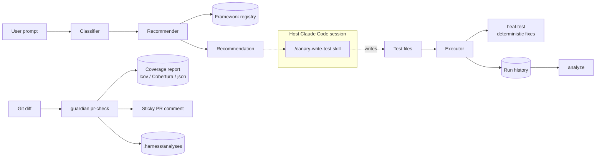

# Architecture Deep Dive 🏗️

Canary is a **deterministic test-intelligence engine**. It classifies intent,
recommends frameworks, scopes coverage, and audits test quality — all without
calling a model. Where LLM judgement is genuinely needed, Canary asks the host
Claude Code session to do it through a skill; the engine itself has no model
client, no API key, and no vendor abstraction.

That boundary is the single most important thing to understand about this
codebase, and it is enforced, not merely intended: the Tier-0 guardian engine
imports no agent/LLM module at all (`SC-11`).

## The pipeline

### 1. Test Classifier (`ts/src/core/classifier.ts`)

Rule-based intent detection over the user's prompt. Categorises the request into
test types like `e2e_ui`, `api`, `performance`, or `unit`. No model involved.

### 2. Framework Recommender (`ts/src/core/recommender.ts`)

The decision engine. Consults the **Framework Registry**
(`ts/src/data/frameworks/registry.json`) to select the best tool for the
detected test type, weighing strengths, maturity, and ecosystem alignment. Each
framework carries a capability tier — `full` (scaffold + run) / `executable`
(run only) / `catalog` (listed only) — so a recommendation states what it can
actually do.

### 3. Command surface (`ts/src/cli.ts`)

There is **no central orchestrator object**. `cli.ts` is a `commander` program
that wires each command directly to the library function behind it, with grouped
sub-commands for the larger subsystems:

| Group               | Owns                                                   |
| ------------------- | ------------------------------------------------------ |
| `guardian`          | Diff-scoped coverage gating, PR comment, analyses emit |
| `analyze`           | Run-history analysis and reports                       |
| `history`           | The run-history store                                  |
| `skills`            | Skill discovery and execution                          |
| `workflow`          | Workflow discovery                                     |
| `company-knowledge` | `.canary/company.json` setup and reads                 |

Everything the engine exposes to an agent runs through `ts/src/mcp-server.ts`,
which is the other entry point into the same libraries.

### 4. Test generation (moved out of the engine in v3.0)

The old provider abstraction layer (factory + vendor providers) was removed in
v3.0. Test generation now runs through the host Claude Code session via the
`/canary-write-test` skill — no provider factory, no vendor clients, and no API
key to configure.

**The engine does not write generated test code.** It supplies the analysis a
skill acts on; the session performs the write.

### 5. Test Executor (`ts/src/core/executor.ts`)

Runs a test command in a subprocess with a timeout, capturing exit code and
stderr. Used by the MCP server and the CLI's shared deps. It reports what
happened; it does not decide what to do about it.

### 6. Deterministic healing (`heal-test`)

`canary heal-test` applies **regex-safe pattern fixes with no LLM**. The
v3.0-era "generate → run → feed the error back to the model → regenerate" loop
no longer exists. Healing is now a bounded, reviewable transformation, and the
`--dry-run` flag shows the change before it is written.

## Data flow

Solid arrows are engine work. **Dashed arrows cross into the host session** —
that is where model judgement lives, and the engine never reaches across that
line itself.

## Fidelity, not guesses

Where the engine reports a verdict it labels how the verdict was derived, so a
weak signal is never mistaken for a measured one. The guardian's coverage ladder
is the canonical example: `coverage-verified` (a real coverage run) beats
`graph-verified` (a call-graph inference) beats `heuristic` (a filename guess).

The same instinct shows up in the reachability sweep, which keeps a dead link
(`broken`, a real defect) structurally distinct from a slow one (`unreachable`,
inconclusive) rather than reporting both as failures.

## Security & sanitisation

Because generation moved to the host session (§4), the engine has **no
generated-file write path** and therefore no extension whitelist guarding one.
Earlier revisions of this page described a `_sanitize_extension` layer; it was
removed with the generation path it protected, and this note replaces it so the
absence is not mistaken for an oversight.

What the engine does still guard:

- **Analyses channel** — `AnalysisArchive.safePath` refuses path traversal when
  writing to `.harness/analyses/`.
- **Config validation** — `.canary/company.json` is parsed with per-field
  validation, drops secret-like values, and warns on genuinely unknown keys.
- **Suppression annotations** — `canary:allow-untested` is honoured only behind
  a real comment leader and only within the diff's added lines, so a bare
  mention in a string or docstring can never clear a gate.

## Keeping this page honest

`scripts/check_removed_symbols.mjs` fails CI when a live doc — including
`docs/wiki/**` — names a removed surface. It matches **identifiers**: deleted
module paths, class names, and env vars. That means prose drift like "the
orchestrator calls the LLM client" still slips through, because no deleted
identifier appears in it.

So when editing this page, check the described _behaviour_ against the code, not
just the paths. This page previously carried current-looking `ts/src/...` paths
attached to components that had ceased to exist — the paths were swept, the
architecture they described was not.
